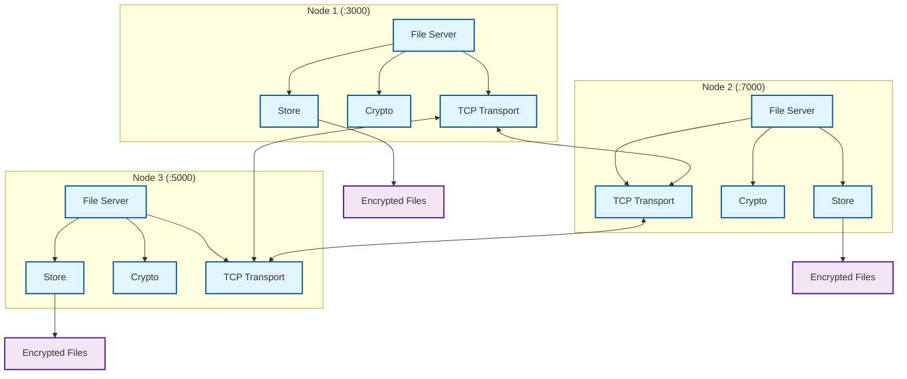

# Drift - System Architecture

## Overview

Drift is a peer-to-peer distributed file system with encryption and content-addressable storage.

## Core Components

- **File Server**: Orchestrates file operations and peer management
- **Store**: Content-addressable storage with SHA1-based paths
- **Crypto**: AES-256 encryption for secure file storage
- **TCP Transport**: P2P network communication layer

## Key Features

- **Distributed Storage**: Files replicated across multiple nodes
- **Content-Addressable**: SHA1-based file addressing and deduplication
- **Encryption**: AES-256 encryption for all stored files
- **P2P Network**: Direct peer-to-peer communication
- **Fault Tolerance**: Continues operating if nodes fail
