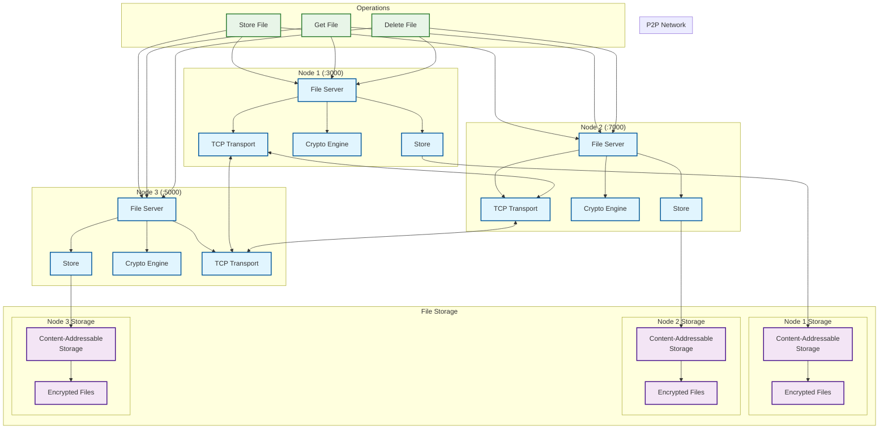

# Drift - Overall Application Architecture

## System Overview
This diagram shows the complete architecture of the Drift distributed file system, including all major components and their interactions.

```mermaid
graph TB
    subgraph "Node 1 (:3000)"
        FS1[File Server]
        Store1[Store]
        Crypto1[Crypto Engine]
        TCP1[TCP Transport]
        
        FS1 --> Store1
        FS1 --> Crypto1
        FS1 --> TCP1
    end
    
    subgraph "Node 2 (:7000)"
        FS2[File Server]
        Store2[Store]
        Crypto2[Crypto Engine]
        TCP2[TCP Transport]
        
        FS2 --> Store2
        FS2 --> Crypto2
        FS2 --> TCP2
    end
    
    subgraph "Node 3 (:5000)"
        FS3[File Server]
        Store3[Store]
        Crypto3[Crypto Engine]
        TCP3[TCP Transport]
        
        FS3 --> Store3
        FS3 --> Crypto3
        FS3 --> TCP3
    end
    
    subgraph "P2P Network"
        TCP1 <--> TCP2
        TCP1 <--> TCP3
        TCP2 <--> TCP3
    end
    
    subgraph "File Storage"
        subgraph "Node 1 Storage"
            CAS1[Content-Addressable<br/>Storage]
            Files1[Encrypted Files]
            CAS1 --> Files1
        end
        
        subgraph "Node 2 Storage"
            CAS2[Content-Addressable<br/>Storage]
            Files2[Encrypted Files]
            CAS2 --> Files2
        end
        
        subgraph "Node 3 Storage"
            CAS3[Content-Addressable<br/>Storage]
            Files3[Encrypted Files]
            CAS3 --> Files3
        end
        
        Store1 --> CAS1
        Store2 --> CAS2
        Store3 --> CAS3
    end
    
    subgraph "Operations"
        StoreOp[Store File]
        GetOp[Get File]
        DeleteOp[Delete File]
        
        StoreOp --> FS1
        StoreOp --> FS2
        StoreOp --> FS3
        
        GetOp --> FS1
        GetOp --> FS2
        GetOp --> FS3
        
        DeleteOp --> FS1
        DeleteOp --> FS2
        DeleteOp --> FS3
    end
    
    classDef nodeClass fill:#e1f5fe,stroke:#01579b,stroke-width:2px
    classDef storageClass fill:#f3e5f5,stroke:#4a148c,stroke-width:2px
    classDef opClass fill:#e8f5e8,stroke:#2e7d32,stroke-width:2px
    classDef networkClass fill:#fff3e0,stroke:#ef6c00,stroke-width:2px
    
    class FS1,FS2,FS3,Store1,Store2,Store3,Crypto1,Crypto2,Crypto3,TCP1,TCP2,TCP3 nodeClass
    class CAS1,CAS2,CAS3,Files1,Files2,Files3 storageClass
    class StoreOp,GetOp,DeleteOp opClass
```

## Component Descriptions

### File Server
- **Purpose**: Main orchestrator for all file operations
- **Responsibilities**: 
  - Manages peer connections
  - Handles incoming/outgoing messages
  - Coordinates file operations across the network
  - Implements replication logic

### Store
- **Purpose**: Local file storage management
- **Responsibilities**:
  - Content-addressable storage using SHA1 hashes
  - Path transformation (hash-based directory structure)
  - File read/write operations
  - Local file management and cleanup

### Crypto Engine
- **Purpose**: File encryption and decryption
- **Responsibilities**:
  - AES-256 encryption in CTR mode
  - Key generation and management
  - Secure file storage and retrieval
  - Data integrity verification

### TCP Transport
- **Purpose**: P2P network communication
- **Responsibilities**:
  - TCP connection management
  - Message routing and handling
  - Peer discovery and handshake
  - Stream-based data transfer

## Key Features

1. **Distributed Replication**: Files are automatically replicated across all connected nodes
2. **Content-Addressable Storage**: Files are stored using SHA1-based addressing for deduplication
3. **End-to-End Encryption**: All files are encrypted with AES-256 before storage
4. **Fault Tolerance**: System continues operating even if some nodes fail
5. **Peer Discovery**: New nodes can bootstrap and join the existing network
6. **Efficient Data Transfer**: Stream-based transfer for large files

## Network Topology

The system uses a mesh topology where each node can communicate directly with every other node. This provides:
- High availability
- Efficient data distribution
- Fault tolerance
- No single point of failure