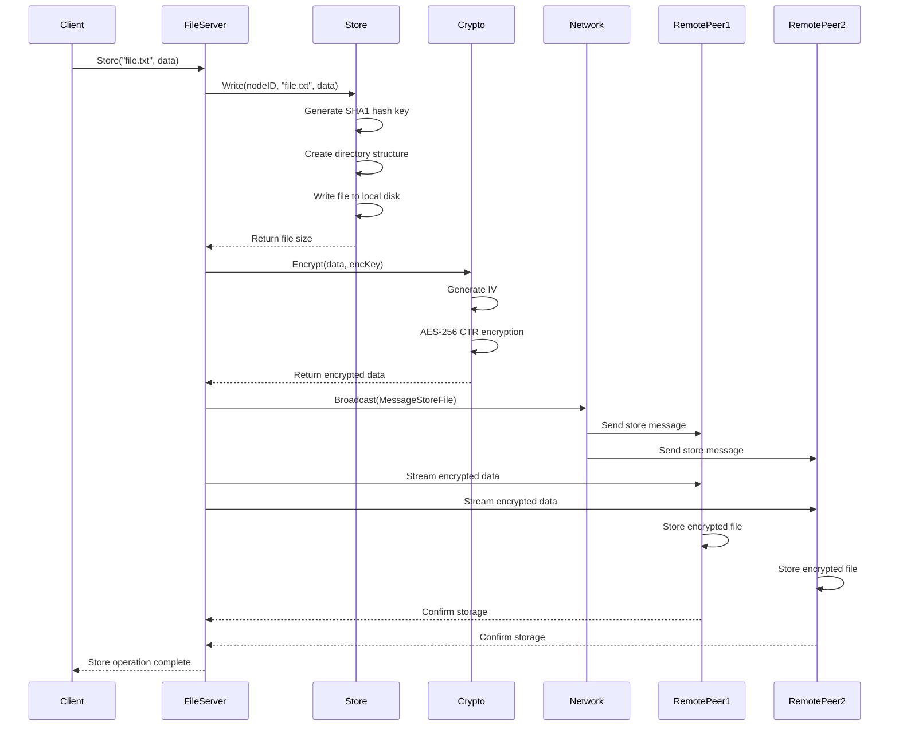
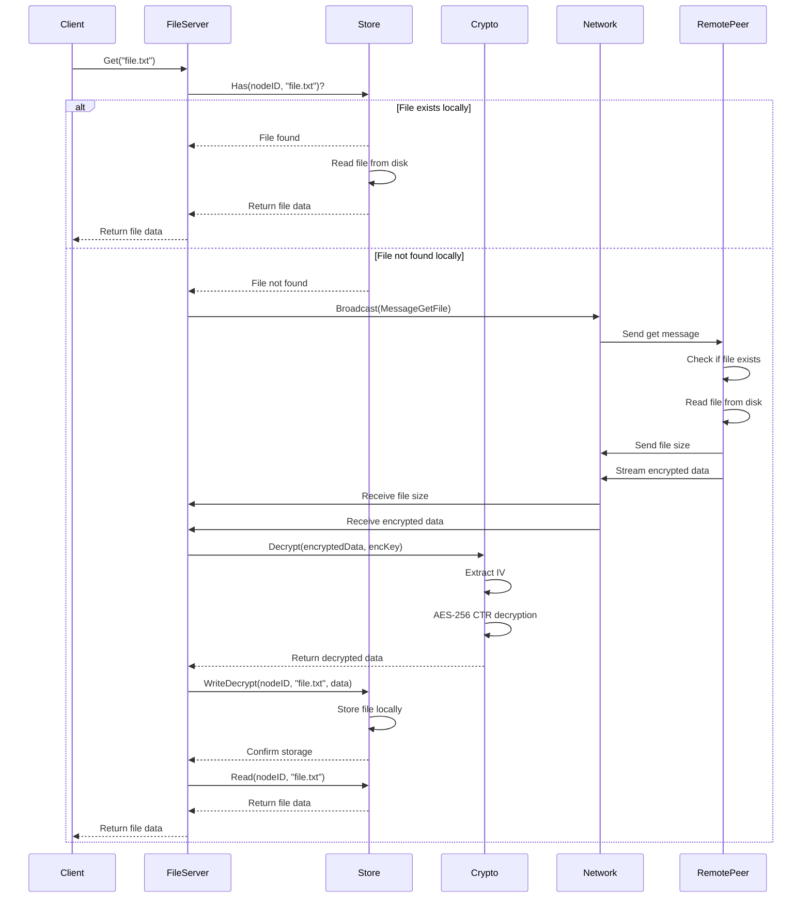
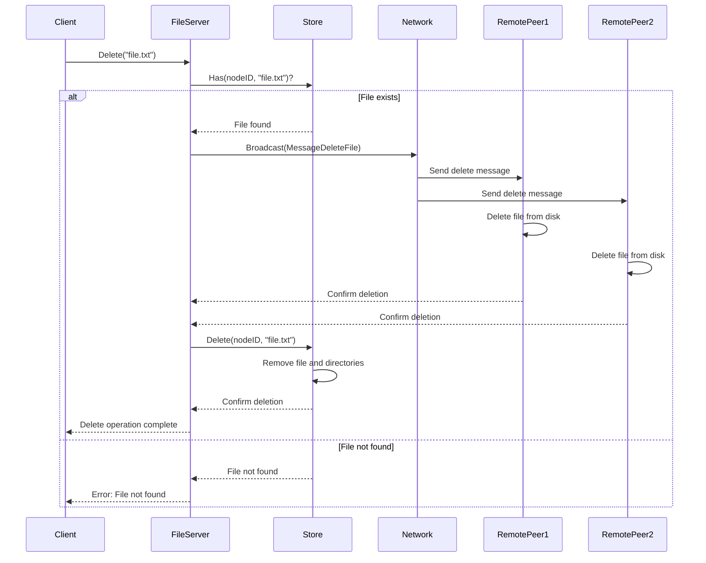
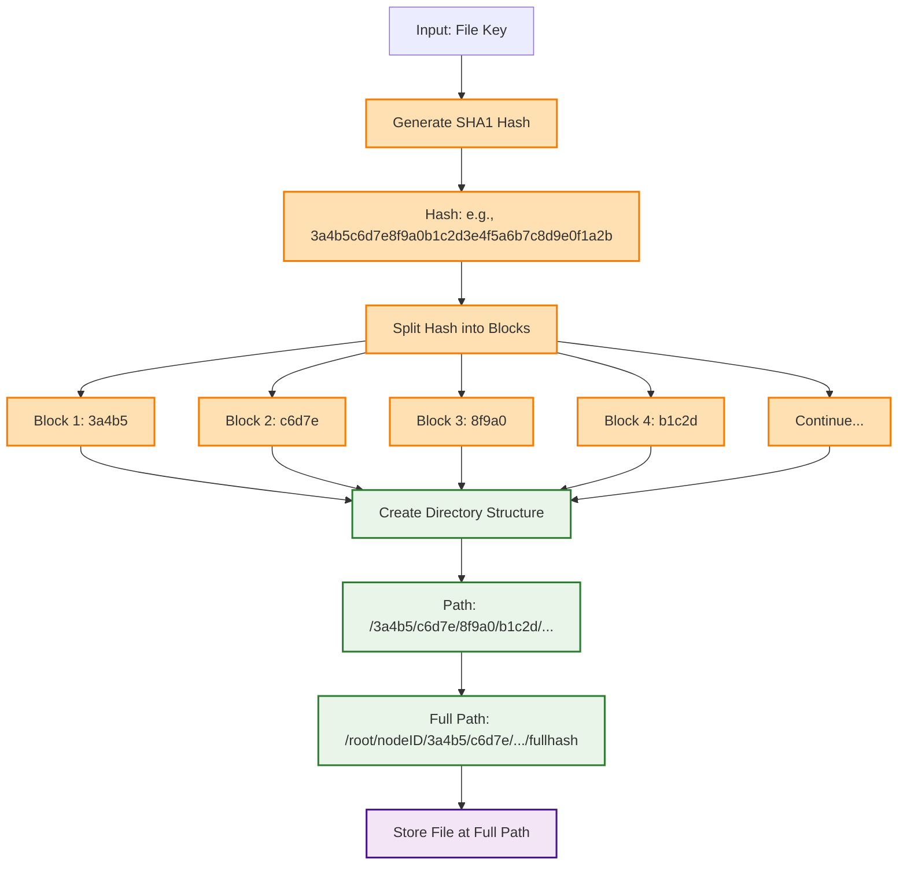
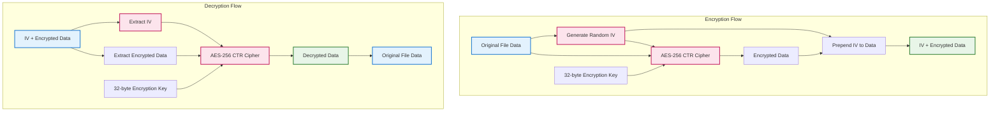
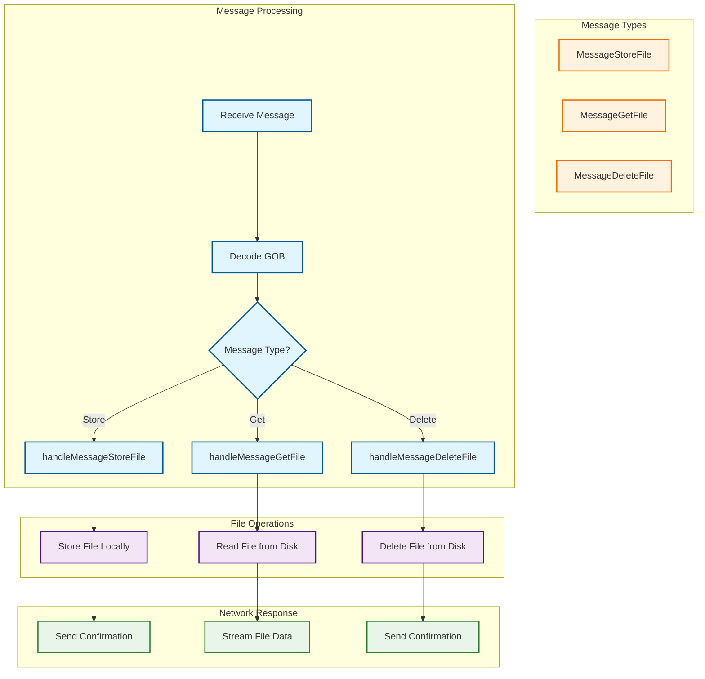

# Drift - Data Flow Diagram

## Data Flow Overview
This diagram illustrates how data flows through the Drift distributed file system during different operations (Store, Get, Delete).

## Store Operation Data Flow

## Get Operation Data Flow

## Delete Operation Data Flow

## Content-Addressable Storage Flow

## Encryption/Decryption Flow

## Network Message Flow

## Key Data Flow Principles

1. **Replication**: Every file operation is replicated across all connected peers
2. **Content-Addressable**: Files are stored using SHA1-based paths for deduplication
3. **Encryption**: All data is encrypted before storage and decrypted after retrieval
4. **Fault Tolerance**: If a file isn't found locally, it's fetched from the network
5. **Consistency**: All peers maintain synchronized copies of files