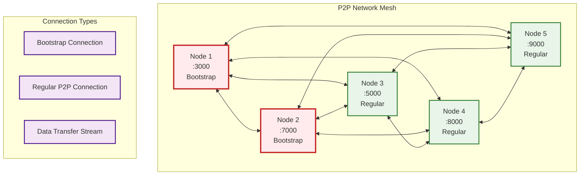
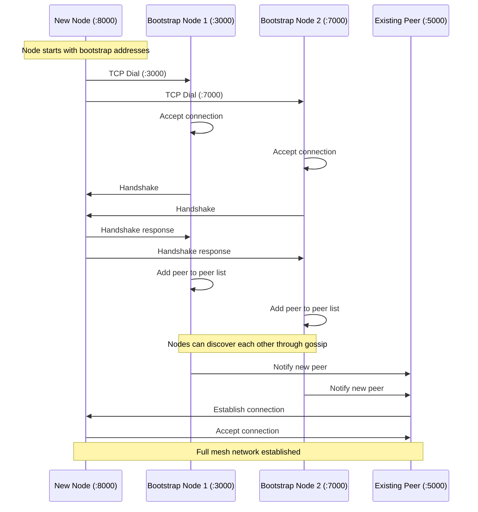
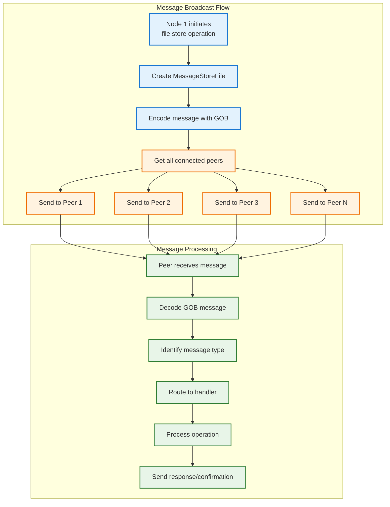
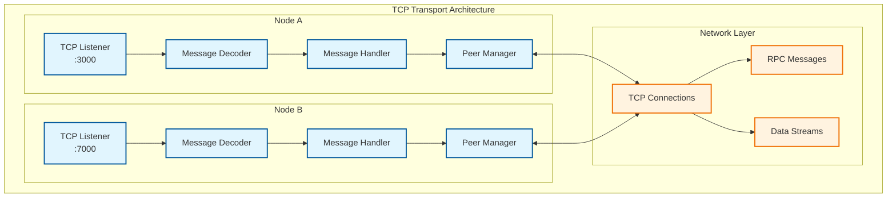
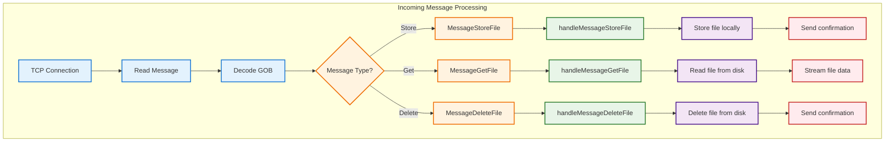
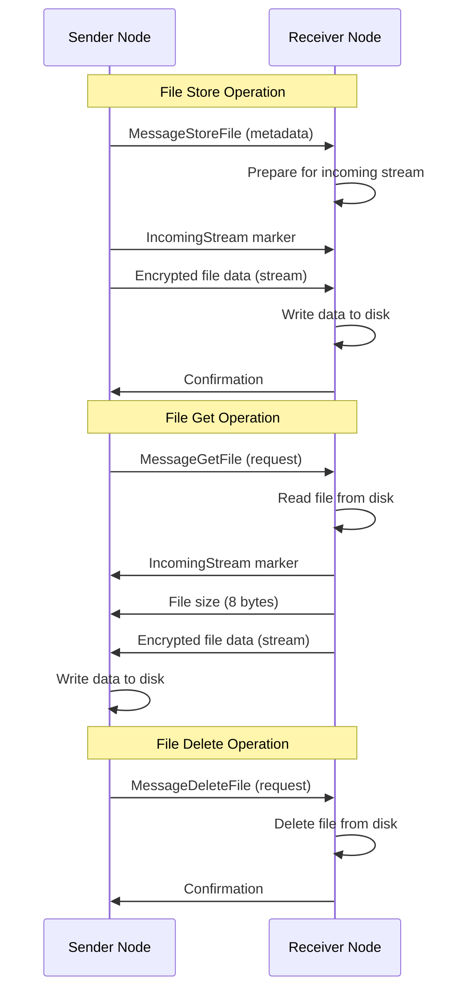
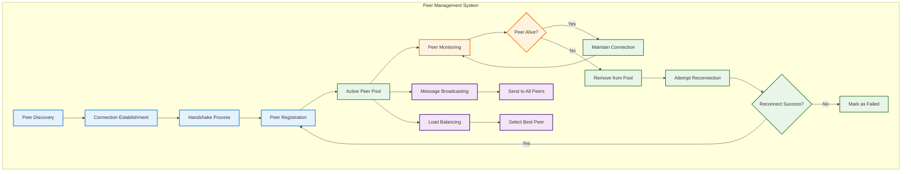
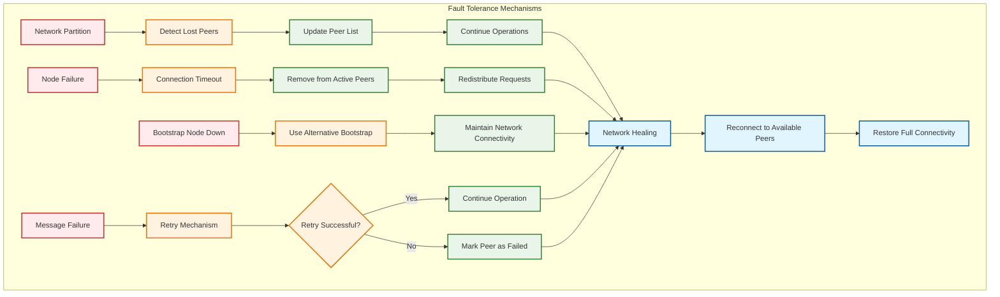

# Drift - P2P Network Communication

## P2P Network Overview
This diagram shows how nodes communicate in the Drift distributed file system, including peer discovery, message routing, and data transfer.

## Network Topology

## Node Bootstrap Process

## Message Broadcasting

## TCP Transport Layer

## Message Types and Handling

## Data Transfer Protocols

## Peer Management

## Network Fault Tolerance

## Key P2P Features

1. **Mesh Topology**: Every node can communicate with every other node
2. **Bootstrap Nodes**: Special nodes that help new nodes join the network
3. **Peer Discovery**: Automatic discovery of peers through bootstrap nodes
4. **Message Broadcasting**: Efficient distribution of messages to all peers
5. **Fault Tolerance**: Network continues operating despite node failures
6. **Load Distribution**: Files are distributed across multiple nodes
7. **Stream-based Transfer**: Efficient transfer of large files
8. **Connection Pooling**: Reuse of TCP connections for multiple operations