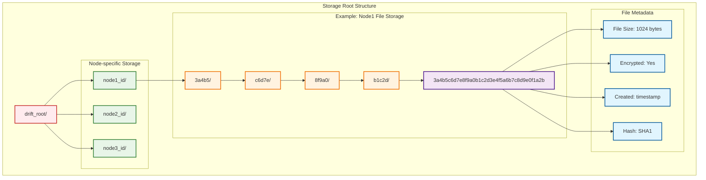
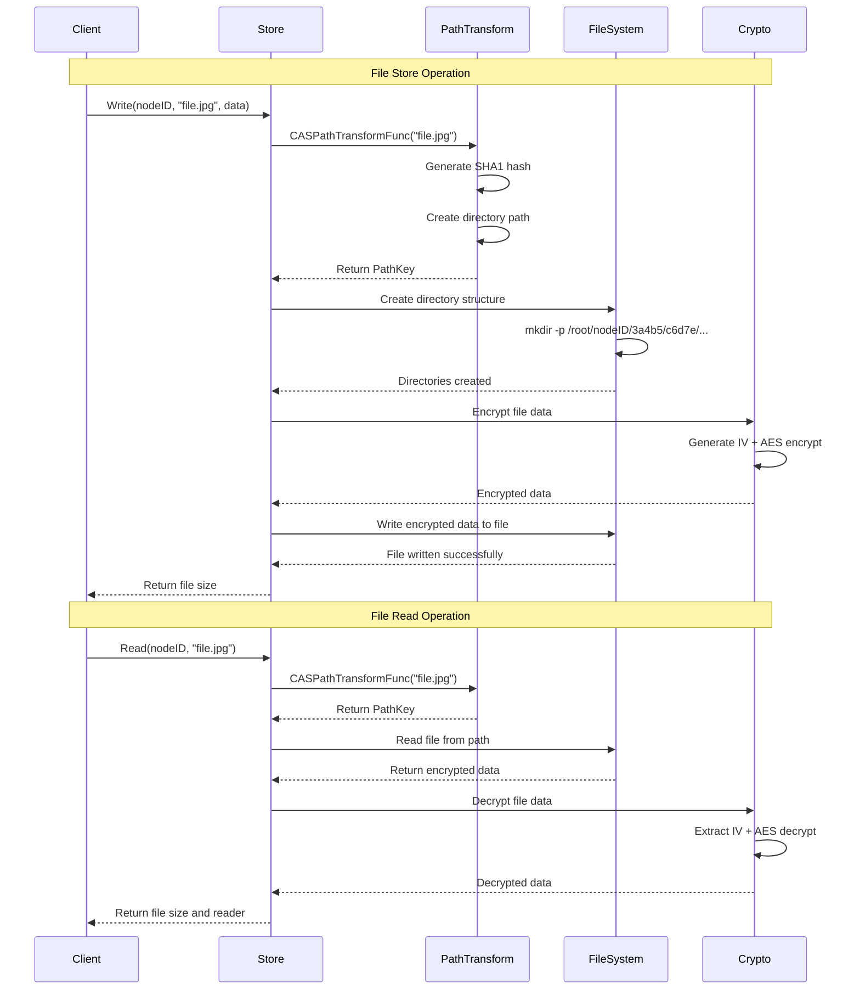
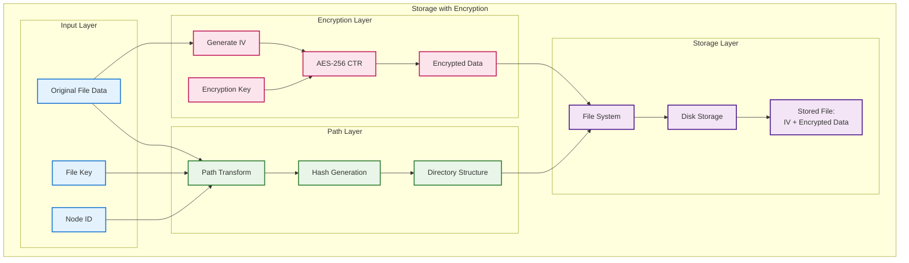
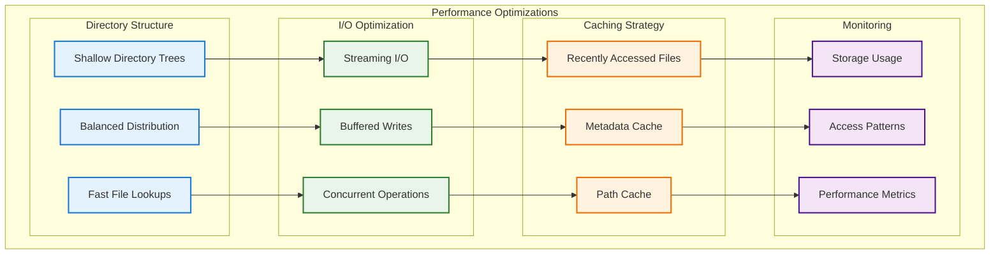
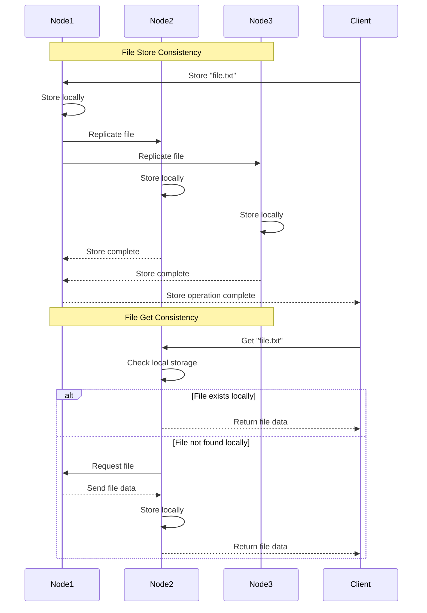

# Drift - File Storage Architecture

## Storage System Overview
This diagram shows the detailed architecture of Drift's content-addressable storage system, including path transformation, encryption, and file organization.

## Content-Addressable Storage (CAS) Architecture

```mermaid
graph TB
    subgraph "File Input"
        A[File Key: "picture.jpg"]
        B[File Data: Binary Content]
    end
    
    subgraph "Hash Generation"
        C[SHA1 Hash Generator]
        D[Generated Hash:<br/>3a4b5c6d7e8f9a0b1c2d3e4f5a6b7c8d9e0f1a2b]
    end
    
    subgraph "Path Transformation"
        E[CASPathTransformFunc]
        F[Split hash into blocks of 5]
        G[Block 1: 3a4b5]
        H[Block 2: c6d7e]
        I[Block 3: 8f9a0]
        J[Block 4: b1c2d]
        K[Block 5: 3e4f5]
        L[Block 6: a6b7c]
        M[Block 7: 8d9e0]
        N[Block 8: f1a2b]
    end
    
    subgraph "Directory Structure"
        O[Root Directory]
        P[Node ID Directory]
        Q[3a4b5/]
        R[c6d7e/]
        S[8f9a0/]
        T[b1c2d/]
        U[3e4f5/]
        V[a6b7c/]
        W[8d9e0/]
        X[File: 3a4b5c6d7e8f9a0b1c2d3e4f5a6b7c8d9e0f1a2b]
    end
    
    A --> C
    B --> C
    C --> D
    D --> E
    E --> F
    F --> G
    F --> H
    F --> I
    F --> J
    F --> K
    F --> L
    F --> M
    F --> N
    
    G --> O
    H --> O
    I --> O
    J --> O
    K --> O
    L --> O
    M --> O
    N --> O
    
    O --> P
    P --> Q
    Q --> R
    R --> S
    S --> T
    T --> U
    U --> V
    V --> W
    W --> X
    
    classDef input fill:#e3f2fd,stroke:#1976d2,stroke-width:2px
    classDef hash fill:#fff3e0,stroke:#ef6c00,stroke-width:2px
    classDef transform fill:#e8f5e8,stroke:#2e7d32,stroke-width:2px
    classDef storage fill:#f3e5f5,stroke:#4a148c,stroke-width:2px
    
    class A,B input
    class C,D hash
    class E,F,G,H,I,J,K,L,M,N transform
    class O,P,Q,R,S,T,U,V,W,X storage
```

## File Storage Hierarchy



## Storage Operations Flow



## Encryption Layer Integration



## Storage Deduplication

```mermaid
flowchart TD
    subgraph "File Deduplication Process"
        A[File 1: "hello.txt"]
        B[File 2: "greeting.txt"]
        C[File 3: "hello.txt"]
        
        A --> D[SHA1: abc123...]
        B --> E[SHA1: def456...]  
        C --> F[SHA1: abc123...]
        
        D --> G{Hash Exists?}
        E --> H{Hash Exists?}
        F --> I{Hash Exists?}
        
        G -->|No| J[Store New File]
        H -->|No| K[Store New File]
        I -->|Yes| L[Reference Existing File]
        
        J --> M[Disk Space: +1 file]
        K --> N[Disk Space: +1 file]
        L --> O[Disk Space: +0 files]
        
        subgraph "Storage Efficiency"
            P[3 Files Uploaded]
            Q[2 Files Stored]
            R[33% Space Saved]
        end
        
        M --> P
        N --> P
        O --> P
        P --> Q
        Q --> R
    end
    
    classDef fileInput fill:#e3f2fd,stroke:#1976d2,stroke-width:2px
    classDef hashProcess fill:#fff3e0,stroke:#ef6c00,stroke-width:2px
    classDef decision fill:#fce4ec,stroke:#c2185b,stroke-width:2px
    classDef storage fill:#e8f5e8,stroke:#2e7d32,stroke-width:2px
    classDef efficiency fill:#f3e5f5,stroke:#4a148c,stroke-width:2px
    
    class A,B,C fileInput
    class D,E,F hashProcess
    class G,H,I decision
    class J,K,L,M,N,O storage
    class P,Q,R efficiency
```

## Storage Performance Optimization



## Storage Consistency Model



## Key Storage Features

1. **Content-Addressable**: Files stored using SHA1 hash-based addressing
2. **Deduplication**: Identical files stored only once across the network
3. **Encrypted Storage**: All files encrypted with AES-256 before storage
4. **Distributed**: Files replicated across multiple nodes for reliability
5. **Efficient Organization**: Hash-based directory structure for fast access
6. **Metadata Tracking**: File size, encryption status, and timestamps
7. **Fault Tolerance**: Files remain accessible even if some nodes fail
8. **Space Efficiency**: Automatic deduplication reduces storage requirements