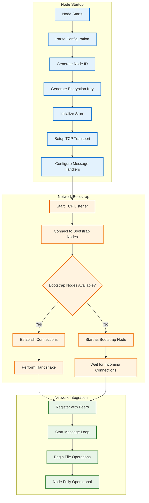
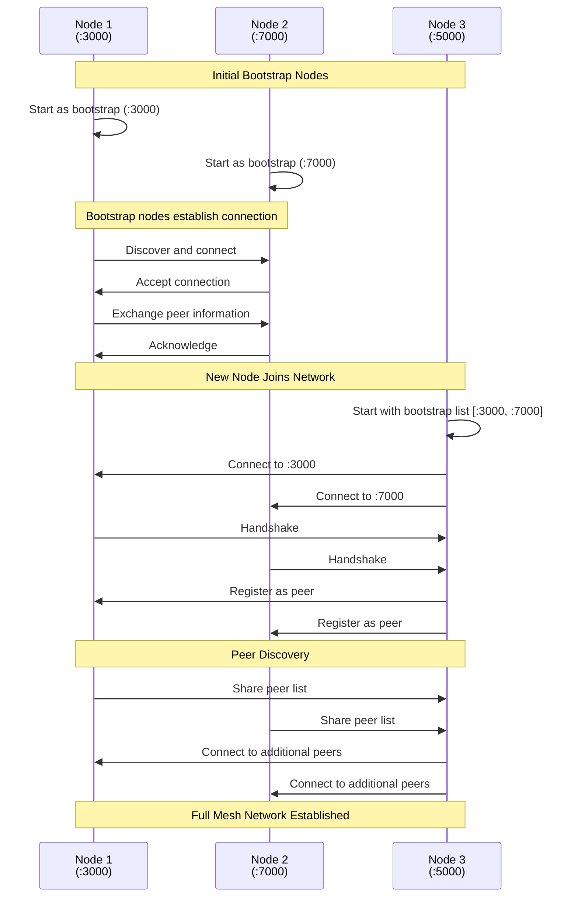
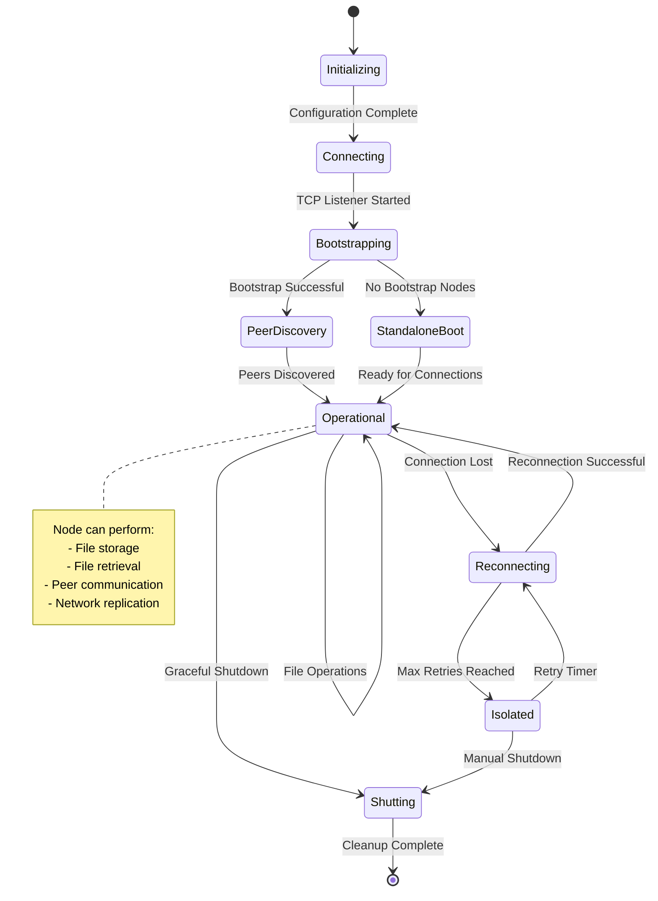
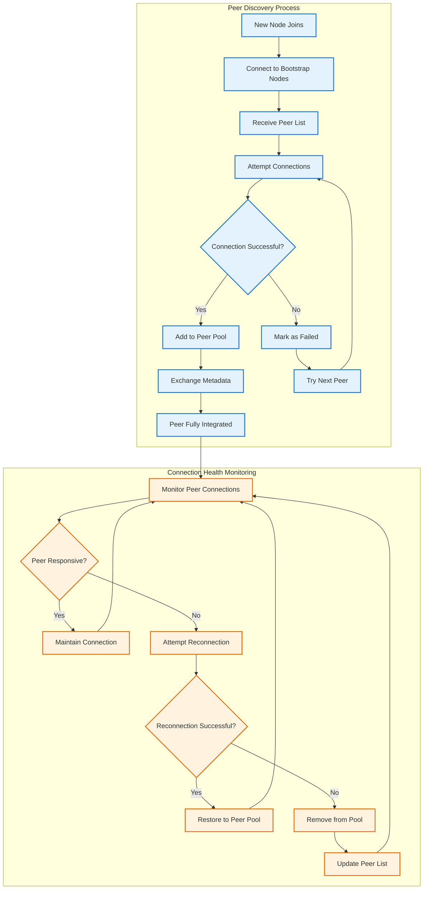
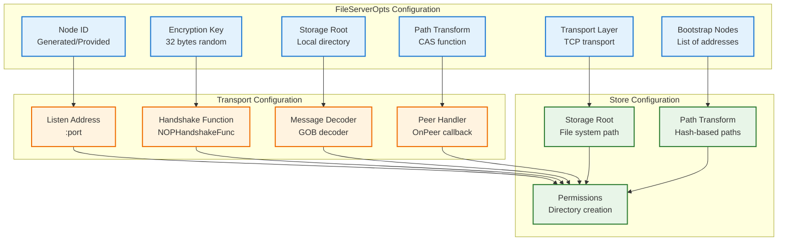
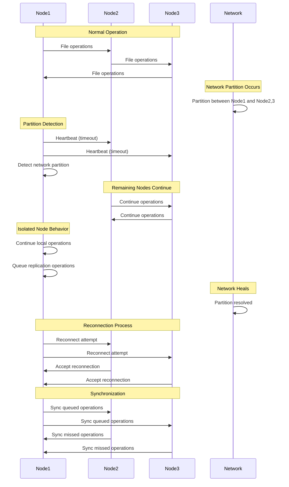
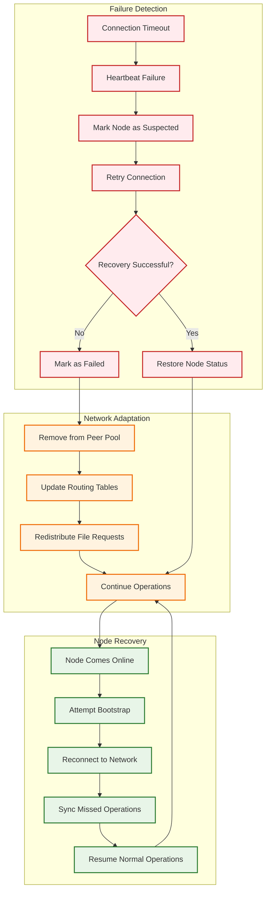
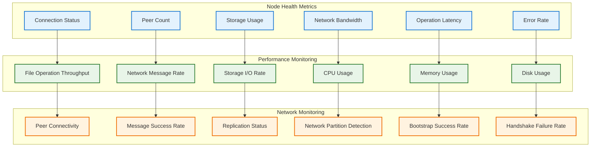

# Drift - Node Lifecycle and Bootstrap Process

## Node Lifecycle Overview
This diagram shows the complete lifecycle of a node in the Drift distributed file system, from initialization to joining the network and handling failures.

## Node Initialization Process

## Bootstrap Network Formation

## Node State Management

## Peer Discovery and Connection Management

## Node Configuration and Initialization

## Network Partition Handling

## Node Failure and Recovery

## Node Metrics and Monitoring

## Key Lifecycle Features

1. **Automatic Bootstrap**: Nodes automatically discover and join the network
2. **Peer Discovery**: Dynamic discovery of peers through bootstrap nodes
3. **Fault Tolerance**: Graceful handling of node failures and network partitions
4. **Self-Healing**: Automatic reconnection and synchronization
5. **Health Monitoring**: Continuous monitoring of node and network health
6. **Configuration Management**: Flexible configuration of node parameters
7. **Graceful Shutdown**: Clean shutdown with proper resource cleanup
8. **Recovery Mechanisms**: Automatic recovery from various failure scenarios