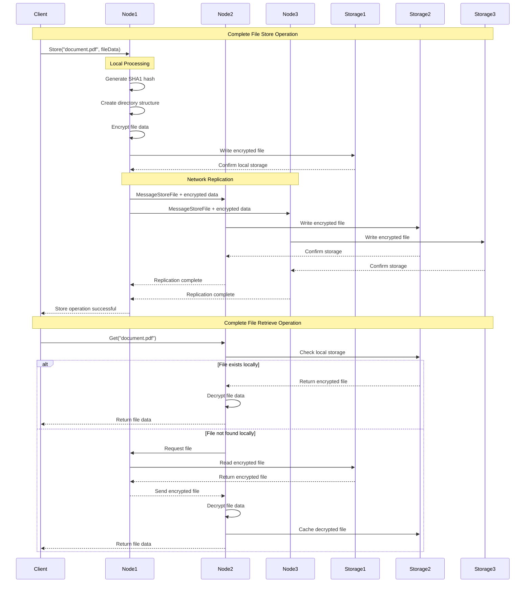
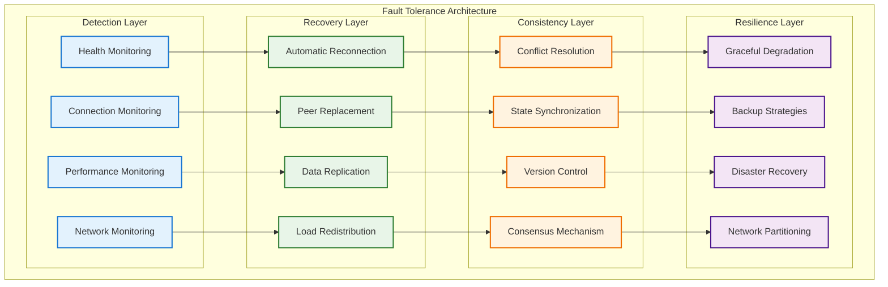
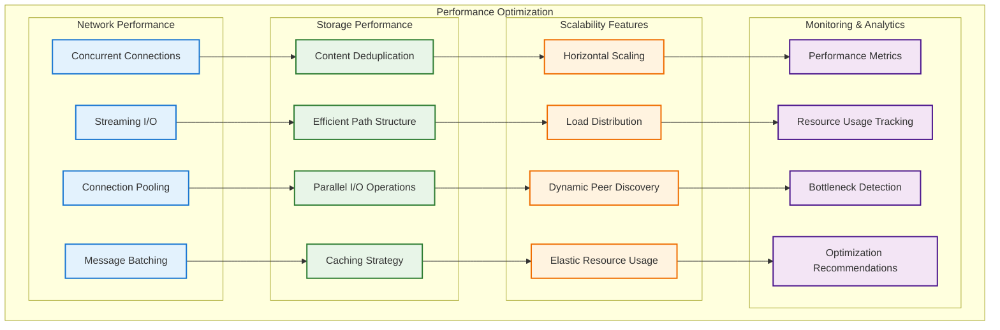
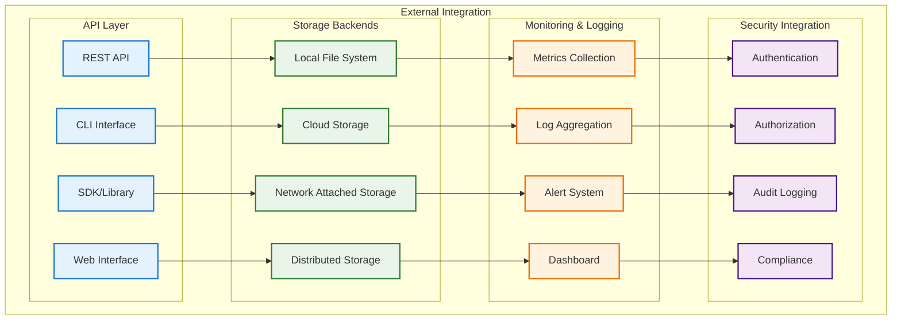

# Drift - Complete System Overview

## System Architecture Overview
This diagram provides a comprehensive view of the entire Drift distributed file system, showing how all components interact and work together to provide a robust, secure, and scalable file storage solution.

## Complete System Architecture

```mermaid
graph TB
    subgraph "Client Layer"
        Client[Client Application]
        API[File Operations API]
        Client --> API
    end
    
    subgraph "Drift Network"
        subgraph "Node 1 (:3000) - Bootstrap"
            subgraph "Core Components 1"
                FS1[File Server]
                Store1[Store]
                Crypto1[Crypto]
                TCP1[TCP Transport]
            end
            
            subgraph "Storage 1"
                CAS1[Content-Addressable Storage]
                Disk1[Local Disk]
                CAS1 --> Disk1
            end
            
            FS1 --> Store1
            FS1 --> Crypto1
            FS1 --> TCP1
            Store1 --> CAS1
        end
        
        subgraph "Node 2 (:7000) - Bootstrap"
            subgraph "Core Components 2"
                FS2[File Server]
                Store2[Store]
                Crypto2[Crypto]
                TCP2[TCP Transport]
            end
            
            subgraph "Storage 2"
                CAS2[Content-Addressable Storage]
                Disk2[Local Disk]
                CAS2 --> Disk2
            end
            
            FS2 --> Store2
            FS2 --> Crypto2
            FS2 --> TCP2
            Store2 --> CAS2
        end
        
        subgraph "Node 3 (:5000) - Regular"
            subgraph "Core Components 3"
                FS3[File Server]
                Store3[Store]
                Crypto3[Crypto]
                TCP3[TCP Transport]
            end
            
            subgraph "Storage 3"
                CAS3[Content-Addressable Storage]
                Disk3[Local Disk]
                CAS3 --> Disk3
            end
            
            FS3 --> Store3
            FS3 --> Crypto3
            FS3 --> TCP3
            Store3 --> CAS3
        end
        
        subgraph "P2P Network Mesh"
            TCP1 <--> TCP2
            TCP1 <--> TCP3
            TCP2 <--> TCP3
        end
    end
    
    subgraph "Operations Flow"
        StoreFlow[Store Operation]
        GetFlow[Get Operation]
        DeleteFlow[Delete Operation]
        
        StoreFlow --> Encrypt[Encrypt File]
        StoreFlow --> Hash[Generate Hash]
        StoreFlow --> Replicate[Replicate to Peers]
        
        GetFlow --> CheckLocal[Check Local Storage]
        GetFlow --> FetchRemote[Fetch from Network]
        GetFlow --> Decrypt[Decrypt File]
        
        DeleteFlow --> RemoveLocal[Remove Local Copy]
        DeleteFlow --> NotifyPeers[Notify Peers]
        DeleteFlow --> Cleanup[Cleanup Storage]
    end
    
    API --> StoreFlow
    API --> GetFlow
    API --> DeleteFlow
    
    StoreFlow --> FS1
    StoreFlow --> FS2
    StoreFlow --> FS3
    
    GetFlow --> FS1
    GetFlow --> FS2
    GetFlow --> FS3
    
    DeleteFlow --> FS1
    DeleteFlow --> FS2
    DeleteFlow --> FS3
    
    classDef clientLayer fill:#e3f2fd,stroke:#1976d2,stroke-width:2px
    classDef bootstrapNode fill:#ffebee,stroke:#c62828,stroke-width:2px
    classDef regularNode fill:#e8f5e8,stroke:#2e7d32,stroke-width:2px
    classDef networkLayer fill:#fff3e0,stroke:#ef6c00,stroke-width:2px
    classDef operationsLayer fill:#f3e5f5,stroke:#4a148c,stroke-width:2px
    classDef storageLayer fill:#fce4ec,stroke:#c2185b,stroke-width:2px
    
    class Client,API clientLayer
    class FS1,Store1,Crypto1,TCP1,CAS1,Disk1,FS2,Store2,Crypto2,TCP2,CAS2,Disk2 bootstrapNode
    class FS3,Store3,Crypto3,TCP3,CAS3,Disk3 regularNode
    class StoreFlow,GetFlow,DeleteFlow,Encrypt,Hash,Replicate,CheckLocal,FetchRemote,Decrypt,RemoveLocal,NotifyPeers,Cleanup operationsLayer
```

## End-to-End Operation Flow

## Security and Encryption Flow

## Fault Tolerance and Recovery

## Performance and Scalability

## System Integration Points

## Key System Characteristics

### 🔒 Security Features
- **End-to-End Encryption**: AES-256 encryption for all stored files
- **Secure Transport**: Encrypted communication between nodes
- **Peer Authentication**: Verified peer connections
- **Data Integrity**: SHA1 hashing for file verification

### 🌐 Network Architecture
- **P2P Mesh Network**: Direct peer-to-peer communication
- **Bootstrap Nodes**: Simplified network joining
- **Fault Tolerance**: Continues operation despite node failures
- **Dynamic Discovery**: Automatic peer discovery and management

### 💾 Storage System
- **Content-Addressable**: Hash-based file addressing
- **Deduplication**: Automatic removal of duplicate files
- **Distributed Replication**: Files stored across multiple nodes
- **Efficient Organization**: Optimized directory structure

### ⚡ Performance Optimizations
- **Concurrent Operations**: Parallel file processing
- **Streaming I/O**: Efficient handling of large files
- **Connection Pooling**: Reuse of network connections
- **Caching**: Intelligent file caching strategies

### 📈 Scalability
- **Horizontal Scaling**: Easy addition of new nodes
- **Load Distribution**: Balanced file distribution
- **Resource Efficiency**: Optimal resource utilization
- **Dynamic Adaptation**: Automatic scaling based on demand